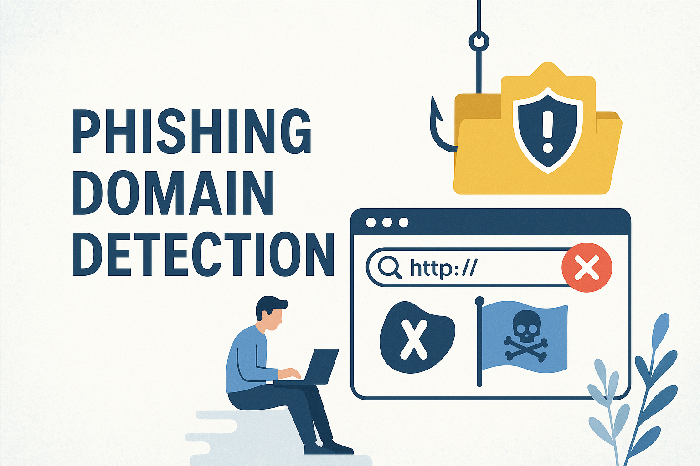

  
</p

## APP Overview:

# 🚀 Phishing Domain Detection

## 📌 Project Overview
Detecting phishing domains using machine learning techniques to enhance cybersecurity by identifying malicious websites.