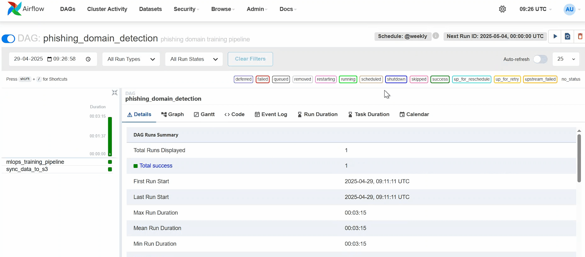
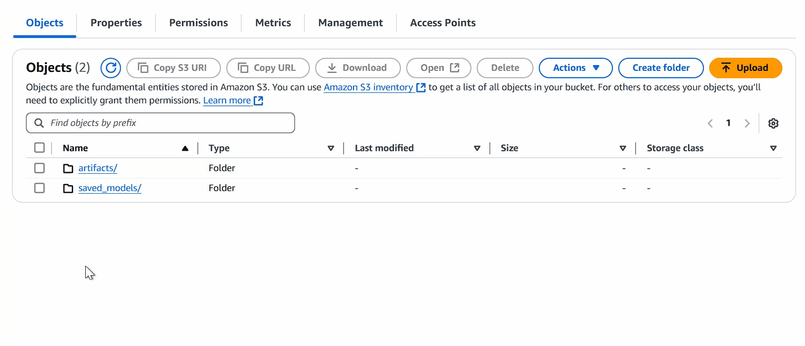

<p align="center">
  
</p>

## 📂 Project Navigation

📁 [**Notebooks**](notebook/) | 📁 [**Pipelines**](phishing/pipeline/) | 📁 [**Airflow DAGs**](airflow/dags/) | 📁 [**Components**](phishing/components)

### 📌 Project Overview

Detecting phishing domains using machine learning techniques to enhance cybersecurity by identifying malicious websites.

This project is designed with a modular, automated pipeline and is deployed as **three Docker containers**:

- **PostgreSQL Server**Stores training data, extracted features, and logs.
- **Apache Airflow**Handles the **continuous training (CT)** pipeline, including:

  - Automated data ingestion and preprocessing
  - Feature extraction and selection
  - Model training and evaluation
  - Syncing the best-performing model and feature extractor to an S3 bucket
- **Streamlit App**Provides a user-friendly web interface for:

  - Predicting phishing domains in real time
  - **Automatically syncing the latest model and feature extractor** from S3 on startup

### ⚙️ Key Features

- **Machine Learning Model:** Detect phishing domains using machine learning.
- **Real-time Detection:** Fast, real-time detection of malicious websites.
- **Interactive UI:** User-friendly and interactive web interface to input domain URLs.
- Fully containerized setup using `docker-compose`
- Automated machine learning pipeline using Airflow DAGs
- Best model selection and S3 synchronization
- Easy deployment in cloud or local environments

---

### **App  Overview:**

<p align="center">
  
</p>

---

### **Model Training(CT) Overview:**

<p align="center">
  
</p>

---

### ☁️ **S3 Bucket Outputs**

The S3 bucket stores all generated outputs, including:

- ✅ **Saved Models**
- 🔍 **Artifacts**

<p align="center">
  
</p>

---

## 🚀 Getting Started

To get started with this project:

### 1. Clone the repository

```bash
git clone https://github.com/your-username/phishing-domain-detection.git
cd phishing-domain-detection
```

### **Key Features**

- **Training and Prediction**: Seamless switching between training and prediction workflows.
- **User-Friendly Interface**: Intuitive and easy-to-use design with a sidebar for navigation.

<h2 align="center">Tools and Technologies Used</h2>
<p align="center">
       
       
       
       
       
       
       
       
       
       
       
       
    
</p>

---

## 🛠️ Step-by-Step Explanation

### 1. **Environment Setup**

- Python 3.8 environment was created to ensure compatibility and scalability.
- Installed all necessary libraries specified in `requirements.txt`.

### 2. **Project Folder Structure**

```
Phishing-Domain-Detection/               # Root directory of the project
│
├── airflow/                            # Airflow setup and configurations
│   └── dags/                           # Airflow Directed Acyclic Graphs (DAGs) for task automation
│       └── training_pipeline.py        # Airflow DAG for training and model deployment pipeline
│
├── artifacts/                          # Intermediate and final output files (models, logs, etc.)
├── saved_models/                       # Saved models and transformers for production
│
├── Dockerfile                          # Docker setup to containerize the application
├── docker-compose.yml                  # Docker Compose for multi-container orchestration
│
├── .github/
│   └── workflows/
│       └── main.yaml                   # CI/CD pipeline setup (GitHub Actions)
│
├── templates/                          # Web application styling and documentation
│   ├── style.css                       # Custom CSS for the web app
│   ├── index.html                      # Web app documentation
│                        
│
├── phishing/                           # Core source code for the phishing domain detection system
│   ├── components/                     # Core pipeline components for data processing, training, etc.
│   │   ├── data_ingestion.py           # Data collection and ingestion logic
│   │   ├── data_validation.py          # Data validation steps
│   │   ├── data_transformation.py      # Data transformation and feature engineering
│   │   ├── model_training.py           # Model training logic
│   │   ├── model_evaluation.py         # Model evaluation and metrics calculation
│   │   └── model_pusher.py             # Deploying the trained model to production
│   │
│   ├── config.py                       # Configuration management (handles environment variables)
│   ├── logger.py                       # Logging utility setup
│   ├── utils.py                        # Miscellaneous utility functions
│   ├── entity/                         # Data structure definitions for pipeline artifacts
│   │   ├── config_entity.py            # Configuration-related entities
│   │   └── artifact_entity.py          # Artifacts generated during the pipeline (models, metrics)
│   │
│   ├── pipeline/                       # Automation scripts for managing pipeline execution
│   │   └── training_pipeline.py        # Automates the model training process
│   │
│   └── exceptions.py                   # Custom exception handling
│
|── docs/                               # Documents(eg.HLD ,LLD ,DPR,etc.)
|
|── demo/                               # demo vedio
|   └── assets/                         # Images, GIFs, etc.
|
|── app.py                              # Streamlit app for domain/url phishing prediction
├── main.py                             # Entry point for training and predictions
├── data_dump.py                        # Dumps data into MongoDB Atlas
├── setup.py                            # Package setup for the `phishing` module
├── LICENSE                             # MIT License file
├── README.md                           # Project documentation
├── requirements.txt                    # Dependencies for the project
└── notebook/                           # Jupyter notebooks for initial analysis
    └── research.ipynb                  # Exploratory data analysis and experiments
```

---

## Deployment Guide

### **Streamlit App Deployment on EC2 using Docker and GitHub Actions**

This guide provides step-by-step commands to deploy a Streamlit app on an EC2 instance using Docker, with automatic deployment through GitHub Actions.

#### Commands for EC2 Setup and Deployment

1. **Launch an EC2 Instance** using the AWS Management Console with your preferred settings.
2. **Connect to Your EC2 Instance**:

```bash
curl -fsSL https://get.docker.com -o get-docker.sh

sudo sh get-docker.sh

sudo usermod -aG docker ubuntu

newgrp docker
```

#### **GitHub Repo Secrets Setup**

- `AWS_ACCESS_KEY_ID`=
- `AWS_SECRET_ACCESS_KEY`=
- `AWS_REGION`=
- `AWS_ECR_LOGIN_URI`=
- `ECR_REPOSITORY_NAME`=
- `BUCKET_NAME`=
- `GOOGLE_CREDENTIALS_B64`= `base64 encoded value`
- `Table_ID`= `project_id.dataset_name.table_name`
- `AIRFLOW_USERNAME`=
- `AIRFLOW_PASSWORD`=
- `AIRFLOW_EMAIL`=

#### **Run All GitHub Runner Commands in AWS CLI and Activate It**

1. Set Up GitHub Actions Runner on EC2
2. Navigate to **Settings > Actions > Runners** in your GitHub repository.
3. Follow the instructions provided by GitHub to download and configure the runner on your EC2 instance.

```bash
curl -o actions-runner-linux-x64-<version>.tar.gz -L https://github.com/actions/runner/releases/download/v<version>/actions-runner-linux-x64-<version>.tar.gz
tar xzf actions-runner-linux-x64-<version>.tar.gz
```
